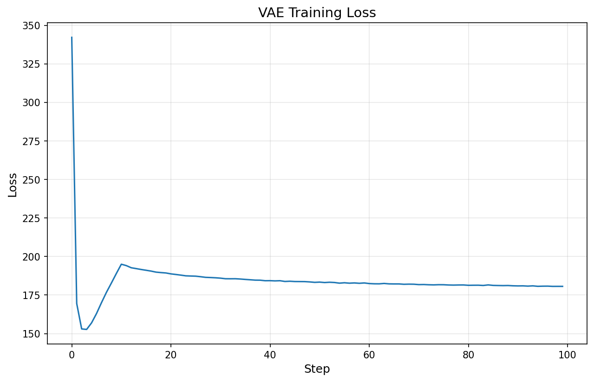
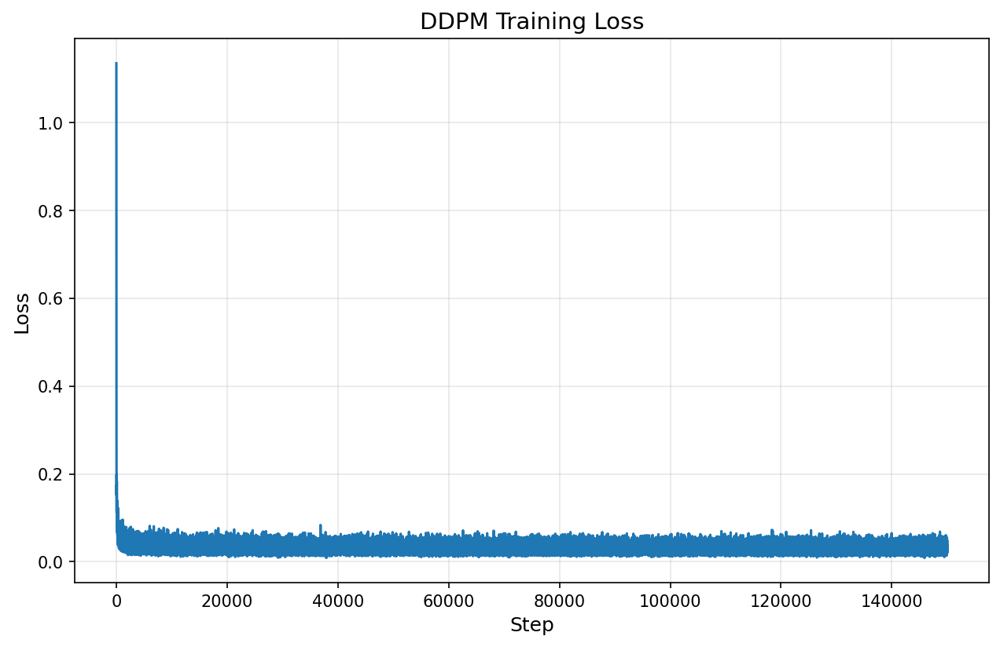
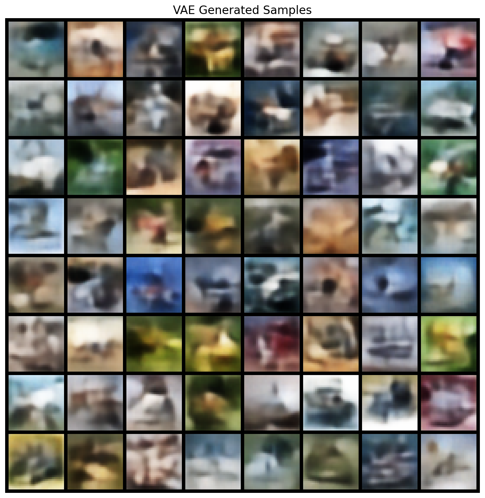
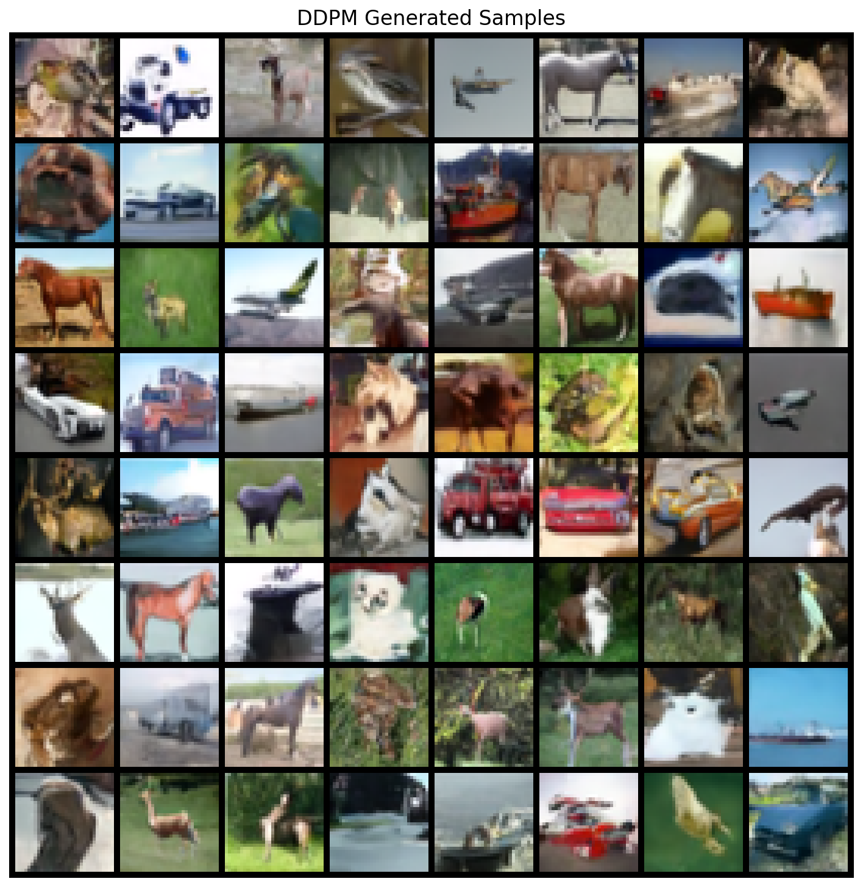

# Comparative Study of VAE and DDPM Generative Models

**Author**: _Omar Ashraf Helmy_

## 1. Introduction

Deep generative models learn to approximate complex data distributions and produce new
samples that resemble the training data. This report presents a from-scratch
implementation of two generative architectures:

- **Variational Autoencoder (VAE)** — a latent-variable model that combines an
  encoder–decoder pair with a probabilistic latent space.
- **Denoising Diffusion Probabilistic Model (DDPM)** — an iterative model that learns
  to reverse a gradual noising process.

Both models are trained on the CIFAR-10 dataset (32×32 colour images, 10 classes) and
evaluated with quantitative metrics (FID, Inception Score) and qualitative visual
inspection. The goal is to highlight the fundamental architectural differences and the
practical performance trade-offs between these two families of generative models.

---

## 2. Theoretical Background

### 2.1 Variational Autoencoder

The VAE frames generation as latent-variable modelling. Given observed data **x** and
latent variables **z**:

1. **Generative model (decoder):** p_θ(x|z) maps latent codes to data space.
2. **Approximate posterior (encoder):** q_φ(z|x) approximates the intractable true
   posterior p(z|x).
3. **Prior:** p(z) = N(0, I).

Training maximises the **Evidence Lower Bound (ELBO)**:

    ELBO = E_{q(z|x)}[ log p(x|z) ] − KL( q(z|x) ‖ p(z) )

- The first term is the **reconstruction loss** (how well the decoder recreates the
  input). We use mean squared error (MSE).
- The second term is the **KL divergence** between the learned posterior and the
  standard Gaussian prior, acting as a regulariser on the latent space.

The **reparameterization trick** allows gradient-based optimisation:

    z = μ + σ ⊙ ε,   ε ~ N(0, I)

### 2.2 Denoising Diffusion Probabilistic Model

DDPMs define a Markov chain that progressively corrupts data with Gaussian noise
(forward process) and then learn to reverse that chain (reverse process).

**Forward process:**

    q(x_t | x_0) = N(x_t;  √ᾱ_t · x_0,  (1 − ᾱ_t) · I)

where ᾱ*t = ∏*{s=1}^{t}(1 − β_s) and {β_t} is a variance schedule.

**Reverse process:**

    p_θ(x_{t−1} | x_t) = N(x_{t−1};  μ_θ(x_t, t),  σ²_t I)

The model (a U-Net) predicts the noise ε added at timestep t. The training objective
is simply:

    L = E_{t, x_0, ε}[ ‖ε − ε_θ(x_t, t)‖² ]

At inference time, images are generated by starting from x_T ~ N(0, I) and iteratively
denoising through all T timesteps.

---

## 3. Architectural Design

### 3.1 VAE Architecture

| Component  | Details                                                                |
| ---------- | ---------------------------------------------------------------------- |
| Encoder    | Conv(3→32) → Conv(32→64) → Conv(64→128), stride 2, BatchNorm, ReLU     |
| Latent dim | 128                                                                    |
| Decoder    | FC → reshape → ConvT(128→64) → ConvT(64→32) → ConvT(32→3), Tanh output |
| Parameters | ~1.4 M                                                                 |

The encoder produces μ and log σ² vectors; the decoder maps a sampled z back to image
space. The architecture is intentionally lightweight, which enables fast training but
limits the capacity to produce sharp outputs — a characteristic VAE trade-off.

### 3.2 DDPM U-Net Architecture

| Component               | Details                                        |
| ----------------------- | ---------------------------------------------- |
| Base channels           | 64                                             |
| Channel multipliers     | [1, 2, 4, 4] → [64, 128, 256, 256]             |
| Residual blocks / level | 2                                              |
| Normalisation           | GroupNorm (32 groups)                          |
| Activation              | SiLU                                           |
| Self-attention          | At 16×16 resolution                            |
| Timestep embedding      | Sinusoidal positional encoding → MLP (dim 256) |
| Parameters              | ~24.3 M                                        |

The U-Net uses skip connections from the encoder to the decoder at every resolution
level. Self-attention at the 16×16 resolution allows the model to capture long-range
spatial dependencies.

A base channel count of 64 with reduced high-resolution channel expansion was chosen to
keep training time and memory usage manageable on available hardware while still
preserving enough model capacity for meaningful generation quality.

---

## 4. Training Procedure

| Setting         | VAE        | DDPM                           |
| --------------- | ---------- | ------------------------------ |
| Optimizer       | Adam       | Adam                           |
| Learning rate   | 1 × 10⁻³   | 1 × 10⁻⁴                       |
| Batch size      | 128        | 64                             |
| Duration        | 100 epochs | 150 000 steps                  |
| KL warm-up      | 10 epochs  | —                              |
| EMA decay       | —          | 0.999                          |
| Mixed precision | No         | No                             |
| Beta schedule   | —          | Linear (1e-4 → 0.02), T = 1000 |
| Random seed     | 42         | 42                             |

**KL warm-up:** The VAE linearly increases the KL weight from 0 to 1.0 over the first
10 epochs. This mitigates posterior collapse, where the encoder learns to ignore the
latent variable and the KL term collapses to zero.

**EMA:** An exponential moving average of the U-Net parameters (decay 0.999) is
maintained during DDPM training and used at sampling time for higher-quality outputs.

---

## 5. Experimental Results

### 5.1 Training Loss Curves

_(training loss plots for VAE and DDPM.)_

### 5.2 Quantitative Evaluation

| Model | FID ↓  | Inception Score ↑ |
| ----- | ------ | ----------------- |
| VAE   | 134.99 | 1.62 ± 0.04       |
| DDPM  | 27.77  | 4.53 ± 0.28       |

These scores were computed using 2000 generated samples for each model. Even at this
limited evaluation size, the DDPM substantially outperforms the VAE on both FID and
Inception Score, indicating much better fidelity and more class-distinct samples.

Lower FID indicates that the distribution of generated images is closer to the real
data distribution. Higher Inception Score indicates sharper, more class-distinct
generated images.

### 5.3 Generated Samples

VAE samples:

DDPM samples:

---

## 6. Qualitative Evaluation

### Realism

The observed results confirm that DDPM-generated images have much higher visual
fidelity than VAE samples. VAE outputs capture coarse object structure and dominant
colors, but remain noticeably blurry. This is consistent with the MSE reconstruction
objective and the lightweight decoder, which tend to favor smooth average
reconstructions over sharp details.

### Diversity

Both models generate multiple semantic modes from CIFAR-10, but the DDPM shows
stronger class separation and more convincing variation. The VAE samples vary in color
and rough layout, yet many outputs resemble blurred mixtures of common training
examples. In contrast, DDPM samples are more distinct and visually coherent.

### Artifacts

The main VAE artifact is persistent blur and weak texture detail. The DDPM exhibits
far fewer structural artifacts in its final outputs, although intermediate checkpoints
can contain residual noise or incomplete denoising patterns early in training.

### Mode Collapse

There is no strong evidence of severe mode collapse in either model. The VAE retains a
meaningful latent representation and produces varied outputs, although its sample space
is less expressive than the DDPM. The DDPM remains more robust because of its
stochastic denoising formulation.

---

## 7. Model Comparison

| Aspect              | VAE                                      | DDPM                                   |
| ------------------- | ---------------------------------------- | -------------------------------------- |
| Generation paradigm | Encode → latent → decode                 | Iterative denoising from noise         |
| Sampling speed      | **Fast** (single forward pass)           | Slow (T reverse steps)                 |
| Image quality       | Blurrier, FID = 134.99, IS = 1.62 ± 0.04 | Sharper, FID = 27.77, IS = 4.53 ± 0.28 |
| Latent space        | Structured, interpolatable               | No explicit latent space               |
| Training time       | Shorter                                  | Longer                                 |
| Parameter count     | ~1.4 M                                   | ~24.3 M                                |
| Theoretical basis   | Variational inference / ELBO             | Score matching / denoising             |

**Key insight:** The measured results strongly favor DDPM for image quality. The DDPM
achieved a much lower FID and a much higher Inception Score, showing that it produces
images that are both more realistic and more class-distinct. The VAE remains valuable
for fast sampling and a structured latent space, but in this experiment it is clearly
weaker as a high-fidelity image generator.

---

## 8. Conclusion

This project demonstrates a complete from-scratch implementation and comparison of two
foundational generative models. The key findings are:

- **DDPM clearly outperformed VAE quantitatively**, achieving **FID = 27.77** and
  **Inception Score = 4.53 ± 0.28**, compared with the VAE's **FID = 134.99** and
  **Inception Score = 1.62 ± 0.04**.
- **DDPM produced substantially sharper and more realistic images**, but required much
  slower sampling and longer training.
- **VAE enabled fast generation and latent-space manipulation**, but its outputs
  remained blurry and less semantically distinct on CIFAR-10.
- Both models successfully learned non-trivial structure from the dataset, confirming
  correct implementation of their respective training objectives, but their practical
  performance differed significantly.
- Architectural choices (channel counts, attention placement, KL warm-up) have
  measurable impact on final quality and must be documented for reproducibility.

These results align with the broader generative modelling literature: VAEs offer
efficiency and latent structure, while DDPMs deliver superior image quality at much
higher computational cost. For this project, DDPM is the stronger generative model in
terms of output fidelity, whereas VAE remains the simpler and faster baseline.
